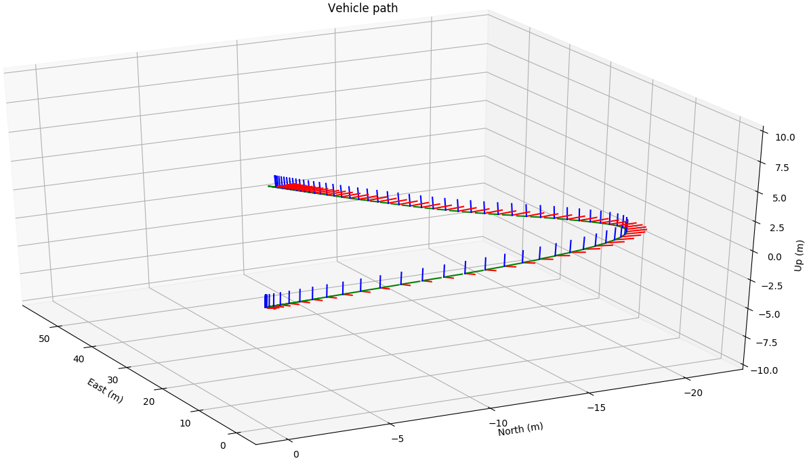
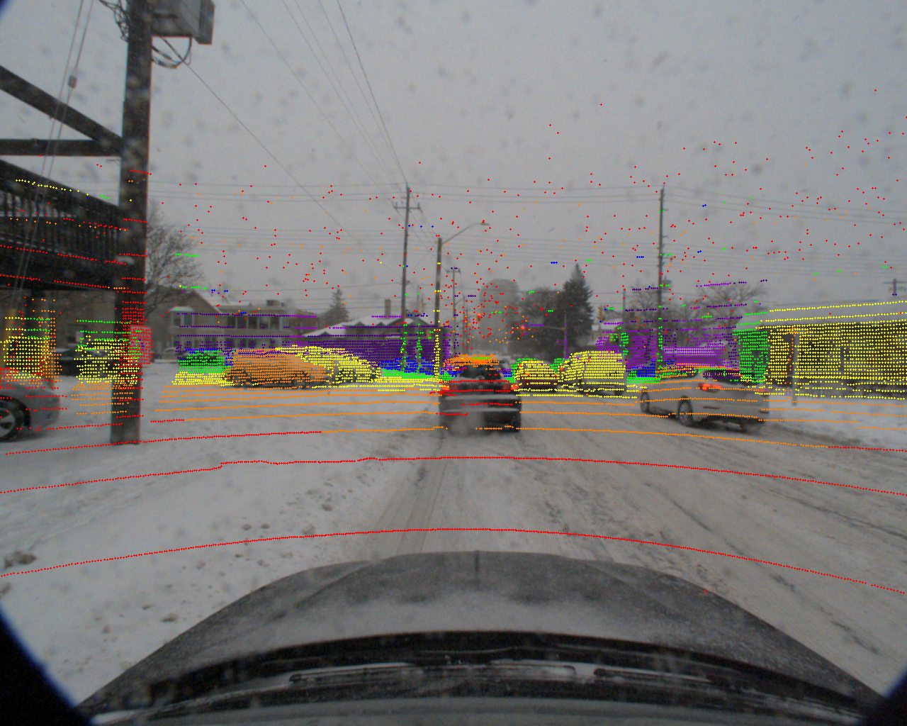
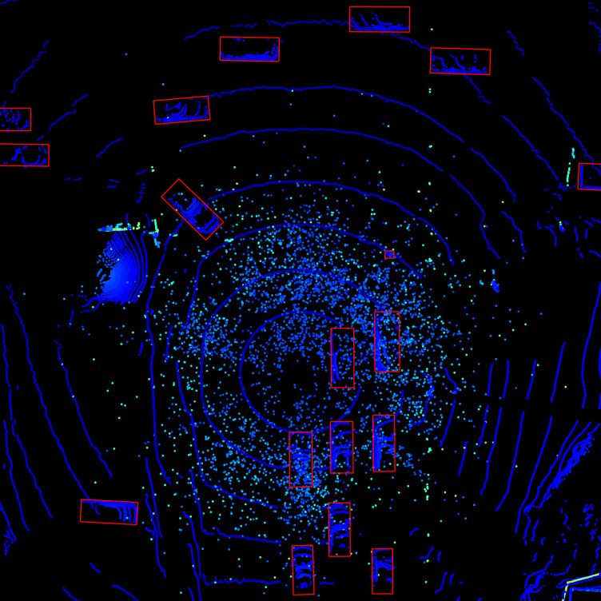

# cadcd_devkit
A devkit for the Canadian Adverse Driving Conditions dataset.

## download_cadcd.py
This will download all raw or labeled data into the given folder.

This dataset is licensed under the [Creative Commons Attribution-NonCommercial 4.0 International License](http://creativecommons.org/licenses/by-nc/4.0/).

## run_demo_vehicle_path.py
This script loads all GPS  messages in a drive, converts them to an ENU frame with the origin at the first message and plots each message as an axis frame.

 <!-- .element height="50%" width="50%" -->

## run_demo_tracklets.py
This script loads a camera image and the corresponding 3D annotation file in a drive, loads the calibration data, then creates and projects each cuboid within the frame onto the camera image.

## run_demo_lidar.py
This script loads a camera image and the corresponding lidar file in a drive, loads the calibration data, then projects each lidar point onto the camera image. Point color is scaled by depth.

## run_demo_lidar_bev.py
This script loads lidar data and the corresponding 3D annotation file in a drive, then creates a birds eye view of the lidar point cloud with the cuboid boxes overlaid.

